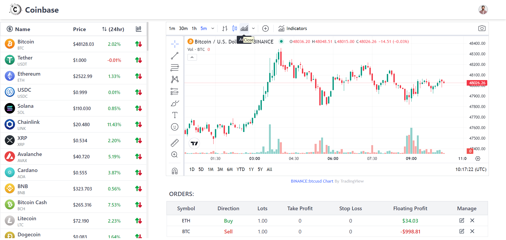

<h1 style="text-align: center;">Coinbase</h1>

## Overview

This project is a trading platform inspired by OctaFX. It allows users to trade cryptocurrencies, manage their orders, and keep track of their balance. The platform also features authentication using JWT tokens for enhanced security.

## Features

- Buy/sell cryptocurrencies
- Manage orders: close and edit orders
- Automatic order closure based on stop loss or take profit triggers
- Secure authentication with JWT tokens

## Tech Stack

- React.js
- RTK Query
- TypeScript
- MongoDB
- Express.js
- Socket.io
- CoinCap API
